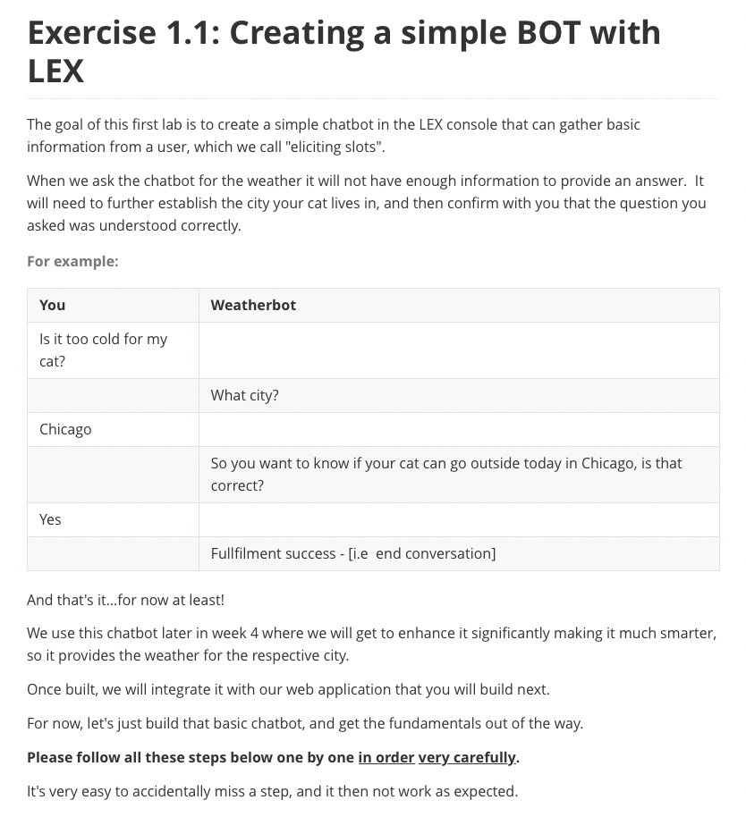

## Exercise 1.1 Creating a Simple Bot with Lex





```
    Can my cat go outside
    Is it warm enough for my cat
    Can I let my cat out in {city_str}
    Should my cat wear booties in {city_str}
    Will my cat stay dry in {city_str}
```


```
		So you want to know if your cat can go out today in {city_str}?
```


```
		Sorry, can you please repeat your initial question?
```


