## Exercise 1.2: Creating a S3 Bucket and Configuring as a Static Website

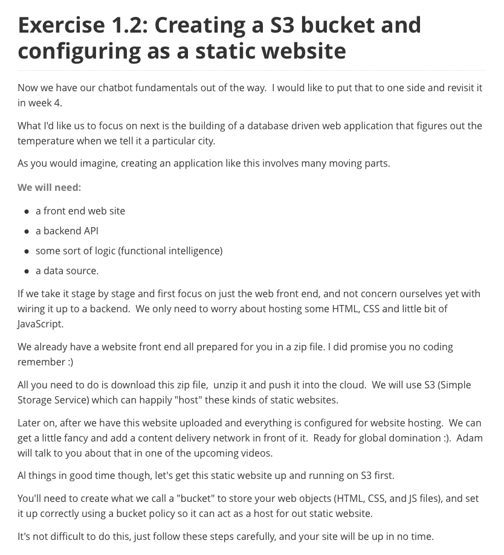

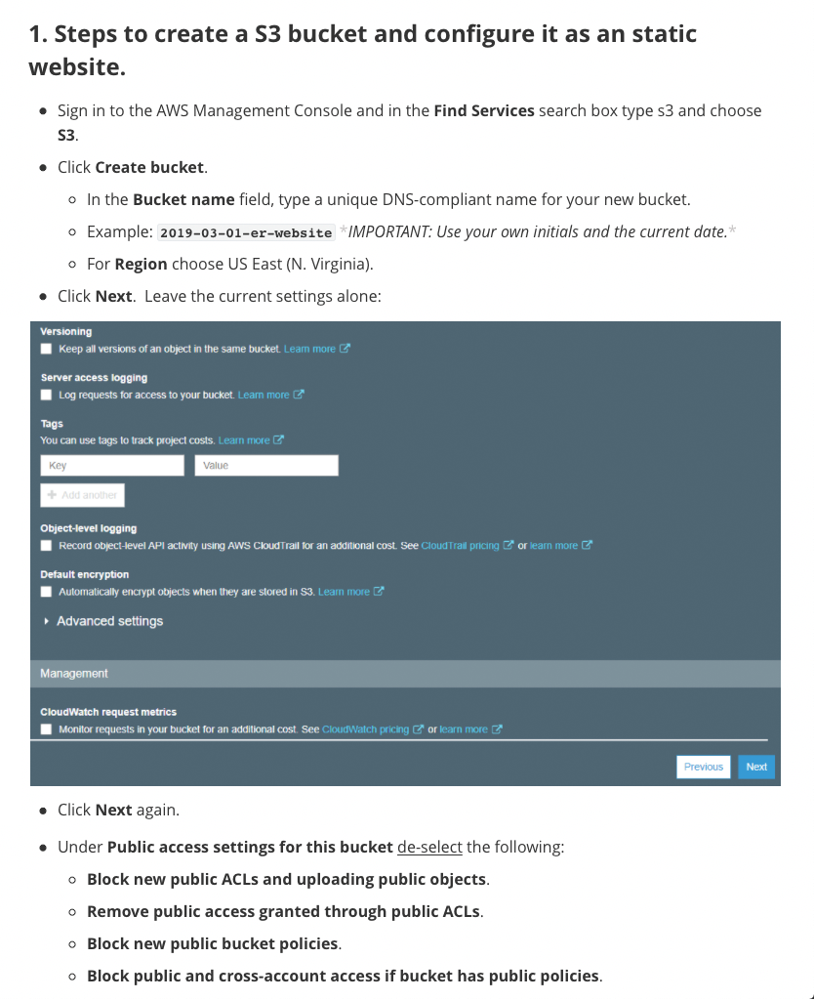

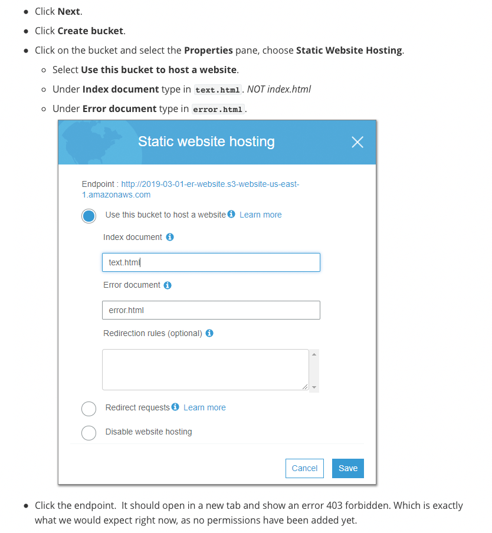

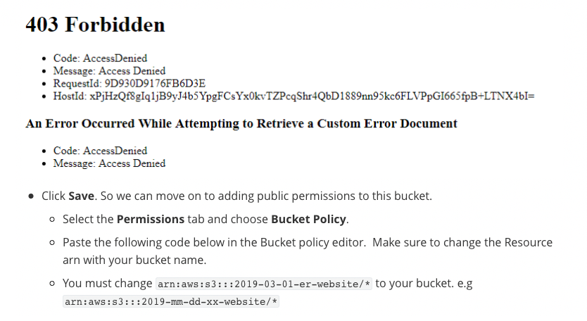

```json
    {
        "Version": "2012-10-17",
        "Statement": [
            {
                "Sid": "AddPerm",
                "Effect": "Allow",
                "Principal": "*",
                "Action": [
                    "s3:GetObject"
                ],
                "Resource": [
                    "arn:aws:s3:::2019-03-01-er-website/*"
                ]
            }
        ]
    }
```

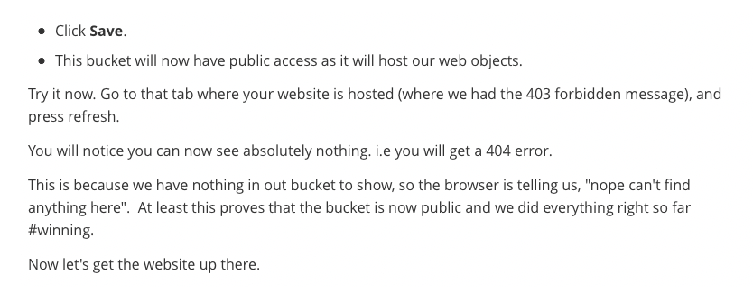


```
		s3website.zip
```


```sh
      + images
          - mobile.jpg
      + scripts
          - config.js
          - helper.js
          - jquery.js
          - text.js
          - voice.js
      + styles
          - reset.css
          - text.css
          - voice.css
      + cities.md
      + error.html
      + favicon.ico
      + index.html
      + README.md
      + text.html
      + voice.html
```

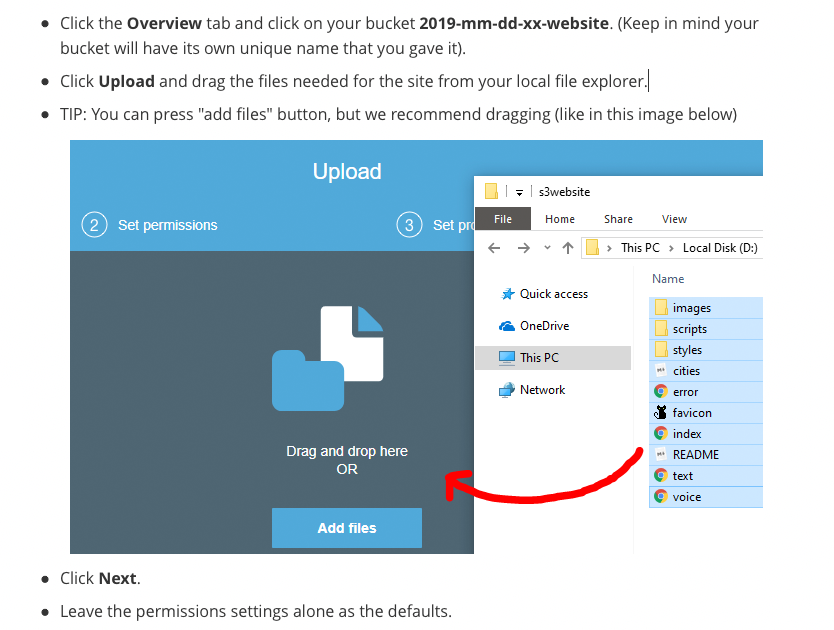

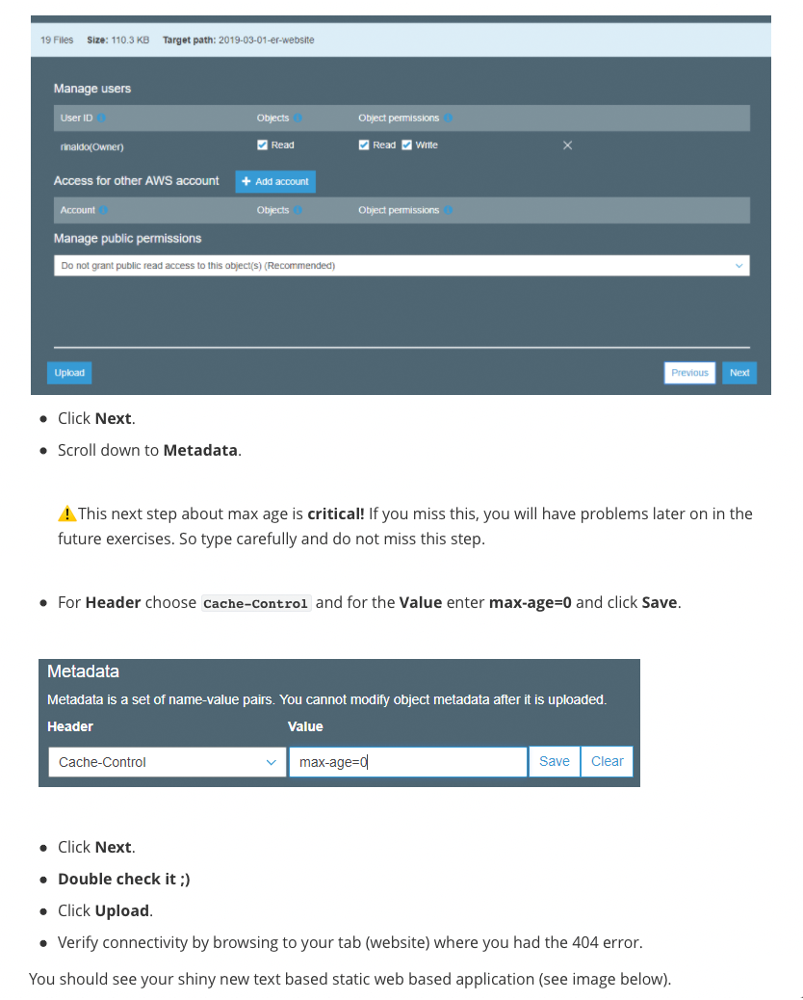

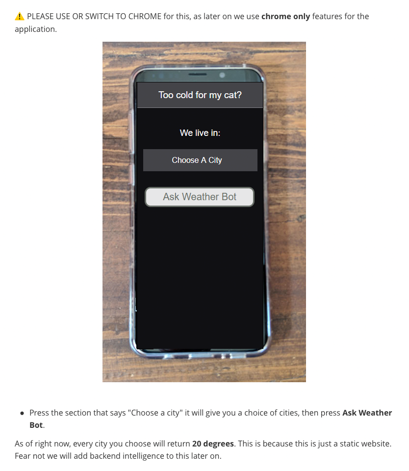

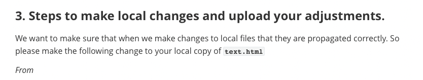

```html
		<h1>Too cold for my cat?</h1>
```


```html
		<h1>Too hot for my cat?</h1>
```

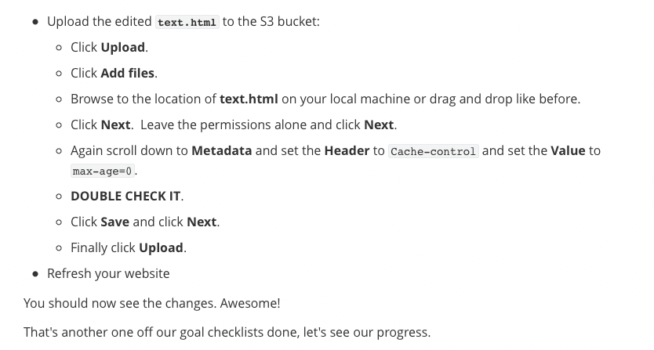

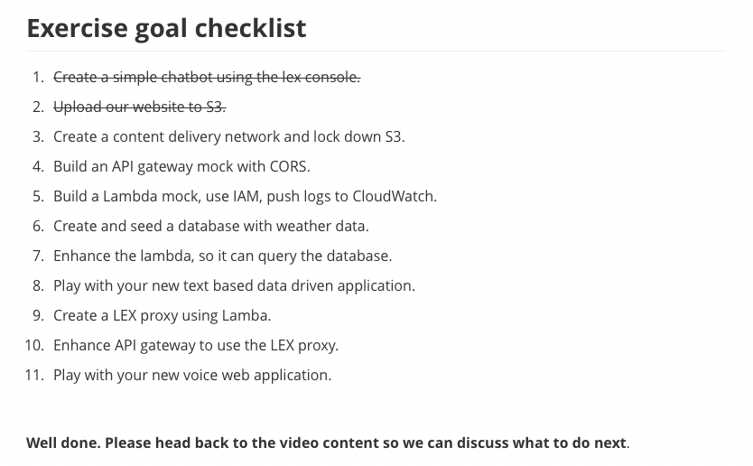