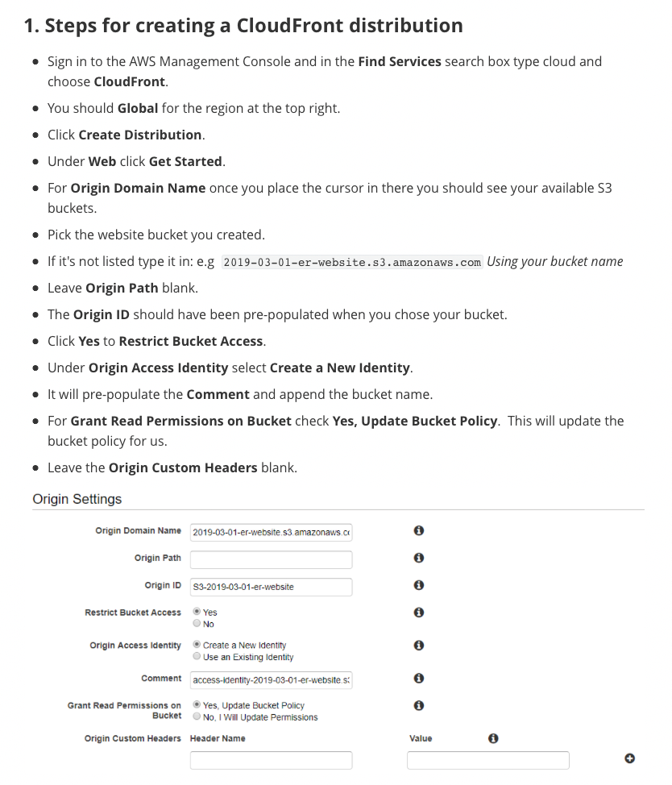
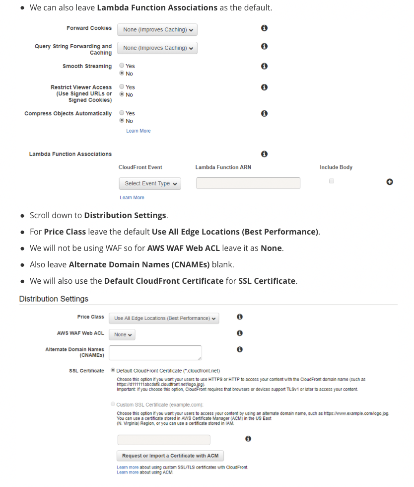

## Exercise 2.1: Creating a CloudFront Distribution








```json
{
    "Version": "2012-10-17",
    "Statement": [
        {
            "Sid": "AddPerm",
            "Effect": "Allow",
            "Principal": "*",
            "Action": "s3:GetObject",
            "Resource": "arn:aws:s3:::2019-03-01-er-website/*"
        },
        {
            "Sid": "2",
            "Effect": "Allow",
            "Principal": {
                "AWS": "arn:aws:iam::cloudfront:user/CloudFront Origin Access Identity E1KO2GAPIWFF7X"
            },
            "Action": "s3:GetObject",
            "Resource": "arn:aws:s3:::2019-03-01-er-website/*"
        }
    ]
}
```


