## Exercise 2.2 Amazon API Gateway

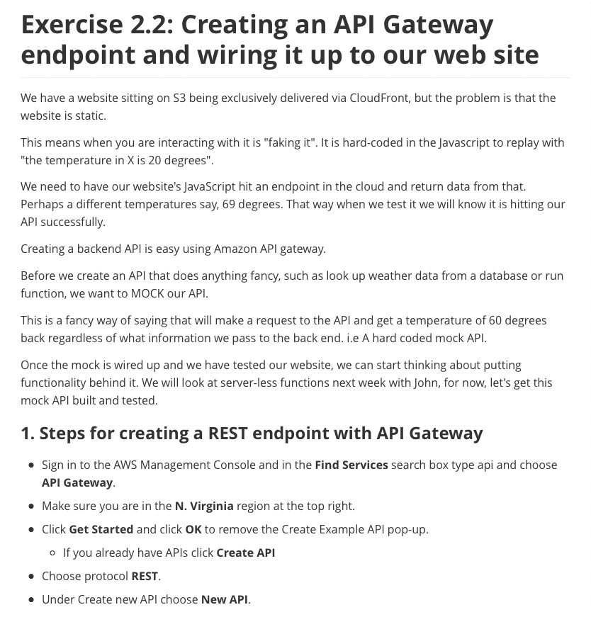

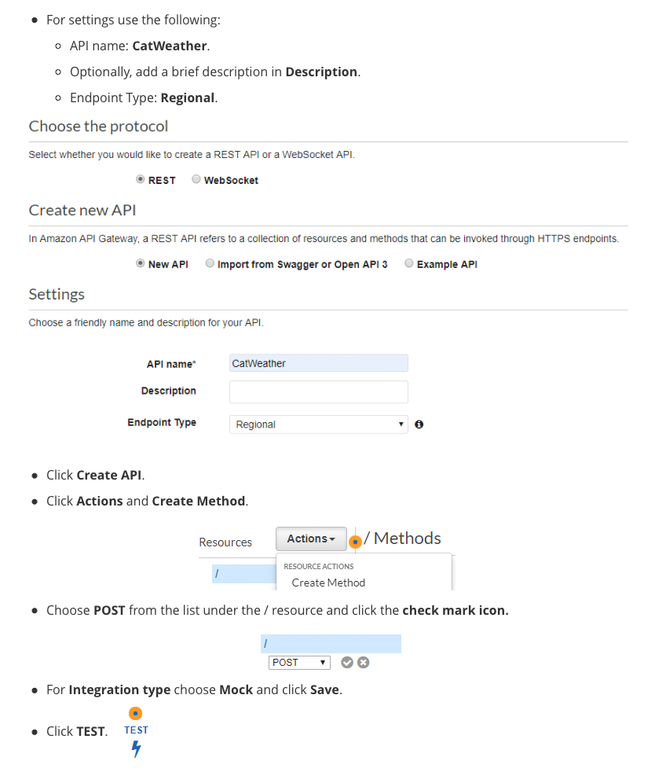


```json
    {
        "city_str": "VEGAS"
    }
```


```
		no data
```


```json
		{"Content-Type":"application/json"}
```


```json
    HTTP Method: POST, Resource Path: /
    Method request path: {}
    Method request query string: {}
    Method request headers: {}
    Method request body before transformations: {
        "city_str": "VEGAS"
    }
    Method response body after transformations: 
    Method response headers: {Content-Type=application/json}
    Successfully completed execution
    Method completed with status: 200
```

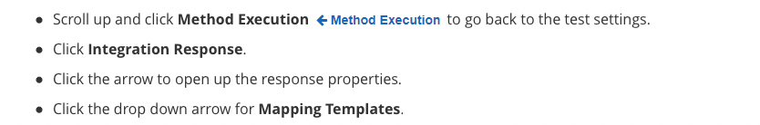

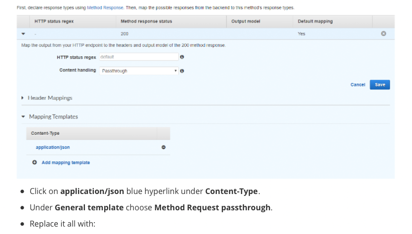

```json
    {
        "temp_int": 69
    }
```

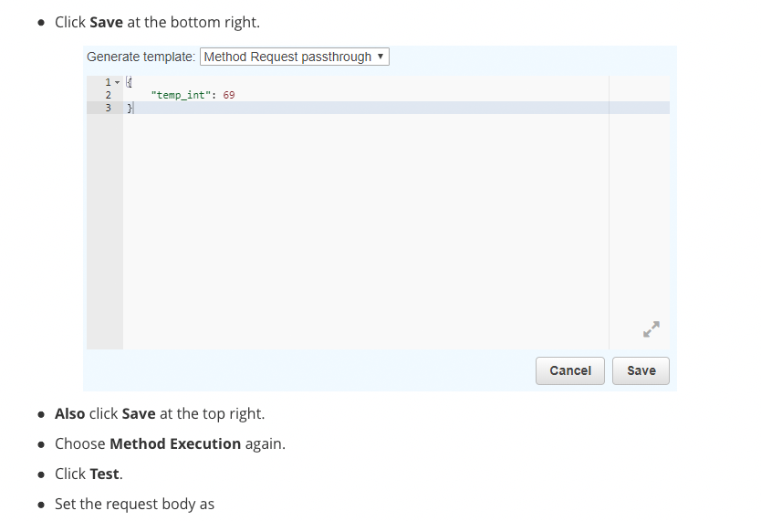

```json
    {
        "city_str": "CHICAGO"
    }
```


```json
    {
        "temp_int": 69
    }
```


```json
		{"Content-Type":"application/json"}
```


```json
    Execution log for request bc5f8d95-3f6b-11e9-9e4c-a7f1e746c2c6
    Starting execution for request: bc5f8d95-3f6b-11e9-9e4c-a7f1e746c2c6
    HTTP Method: POST, Resource Path: /
    Method request path: {}
    Method request query string: {}
    Method request headers: {}
    Method request body before transformations:   {
          "city_str": "CHICAGO"
      }
    Method response body after transformations: {
        "temp_int": 69
    }

    Method response headers: {Content-Type=application/json}
    Successfully completed execution
    Method completed with status: 200
```

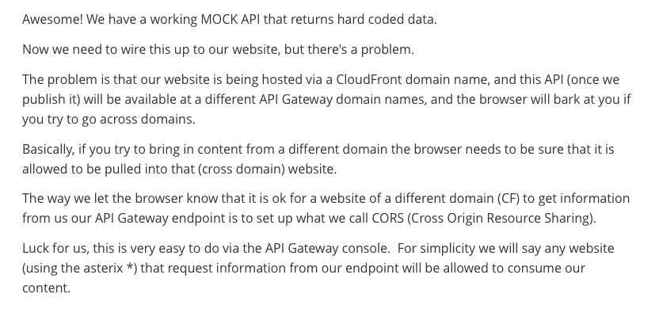

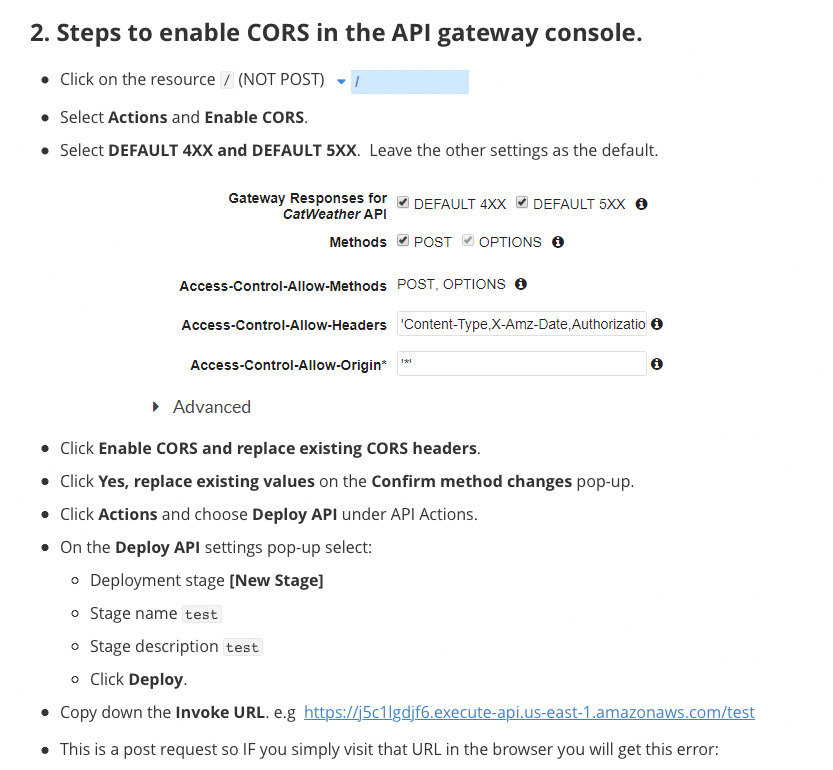

```json
    {
      "message": "Missing Authentication Token"
    }
```


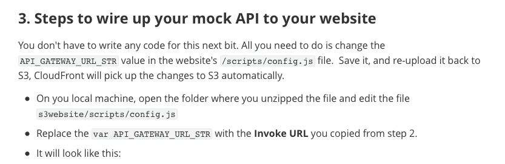

```javascript
		var API_GATEWAY_URL_STR = null;
```


```javascript
    var API_GATEWAY_URL_STR = "https://Your-Invoke-URL.execute-api.us-east-1.amazonaws.com/test";
```

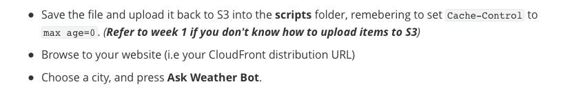

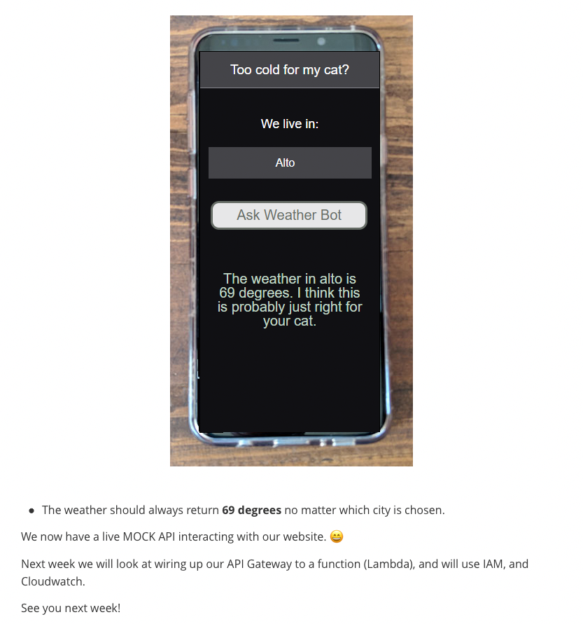

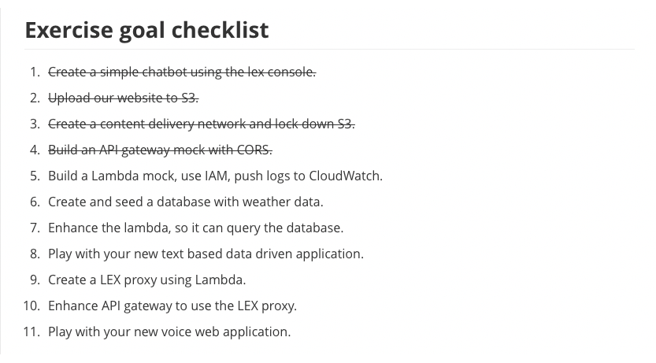