## Exercise 3.1 Creating an AWS Lambda Function

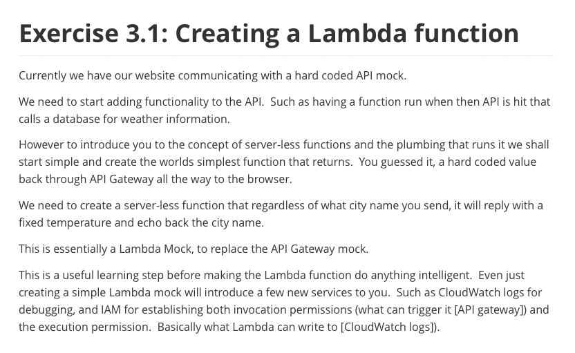

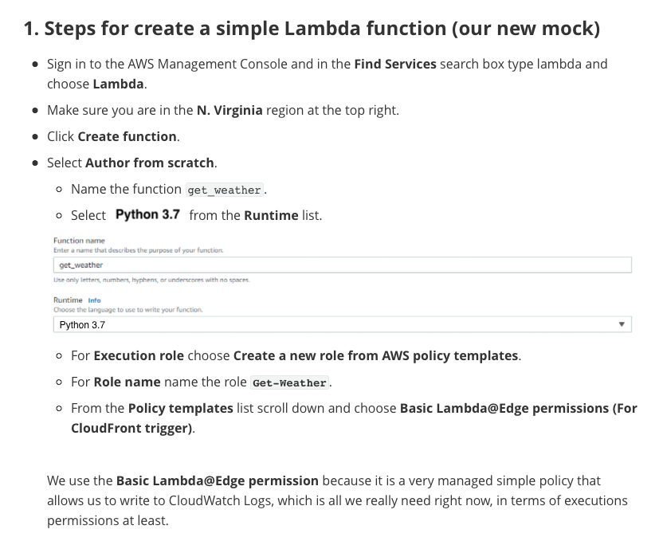

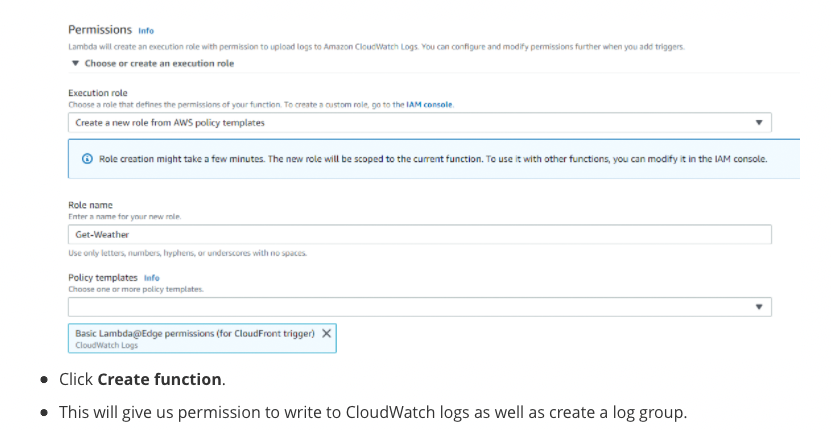

```json
    {
        "Version": "2012-10-17",
        "Statement": [
            {
                "Effect": "Allow",
                "Action": [
                    "logs:CreateLogGroup",
                    "logs:CreateLogStream",
                    "logs:PutLogEvents"
                ],
                "Resource": [
                    "arn:aws:logs:*:*:*"
                ]
            }
        ]
    }
```

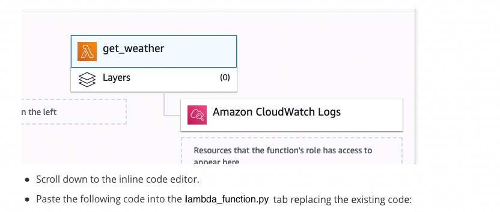

```python
def lambda_handler(event, context):
    city_str = event['city_str']
    response = {
        "city_str": city_str,
        "temp_int": 74
    }
    return response
```

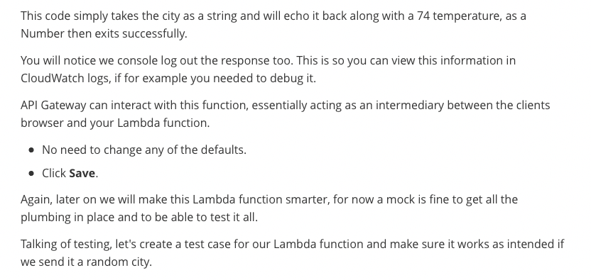

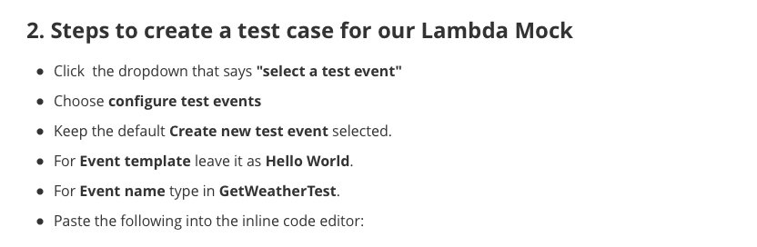

```json
    {
     "city_str": "LA"
    }
```

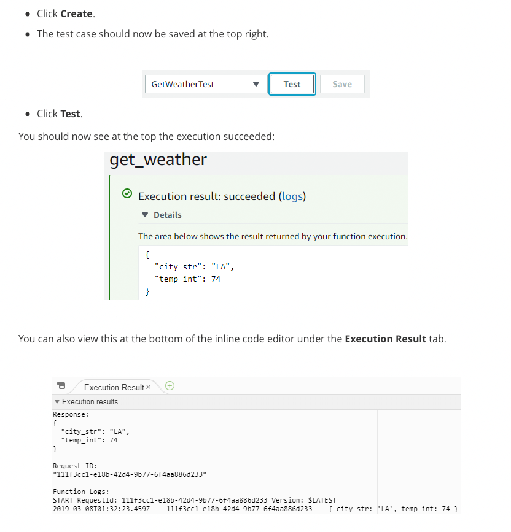

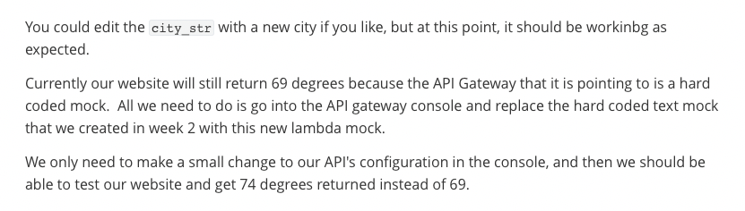

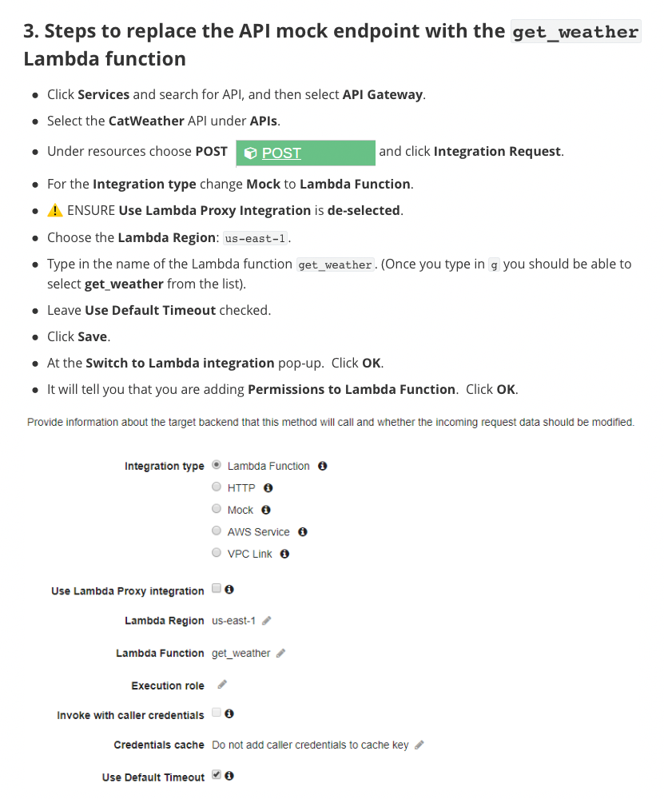


```json
    {
       "city_str": "SEATTLE"
    }
```


```json
   {
     "city_str": "SEATTLE",
     "temp_int": 74
   }
```


```sh
    Sending request to https://lambda.us-east-1.amazonaws.com/2015-03-31/functions/arn:aws:lambda:us-east-1:179741345863:function:get_weather/invocations
    Method response body after transformations: {"city_str":"SEATTLE","temp_int":74}
```

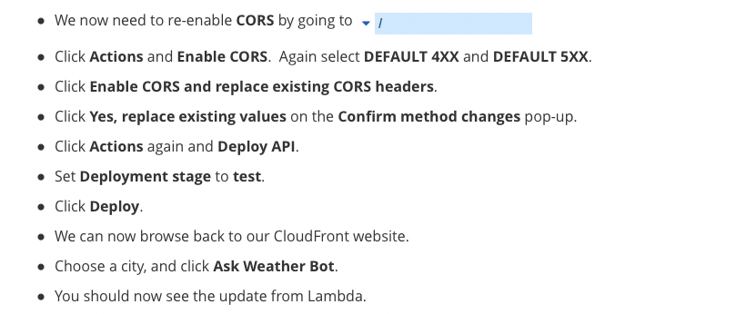

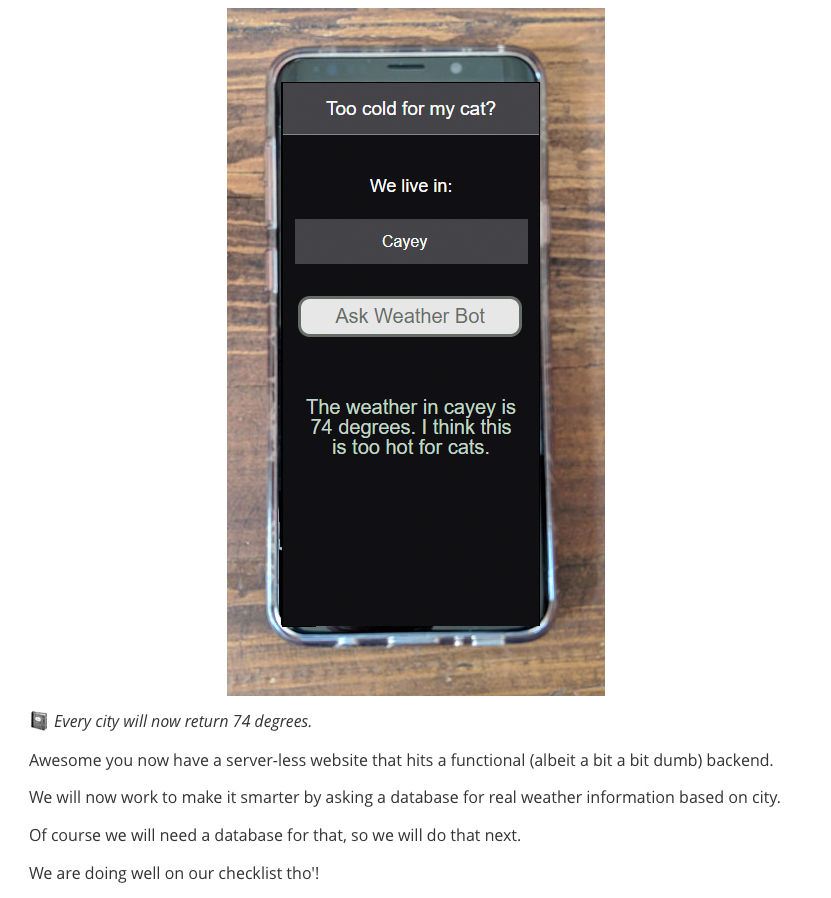

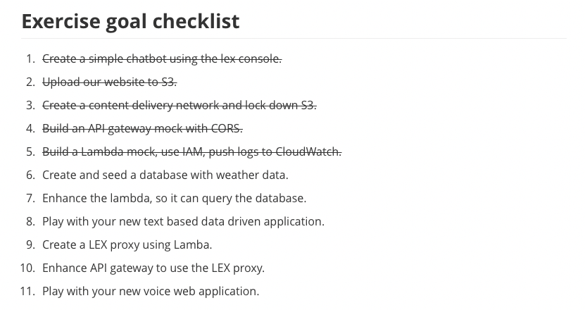

