## Exercise 3.2 Amazon DynamoDB

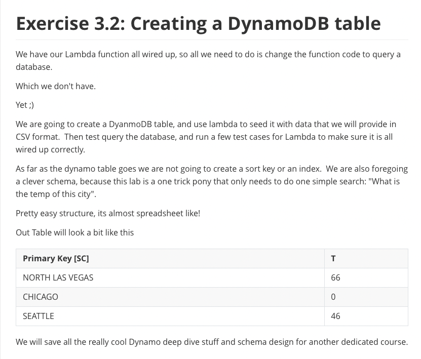

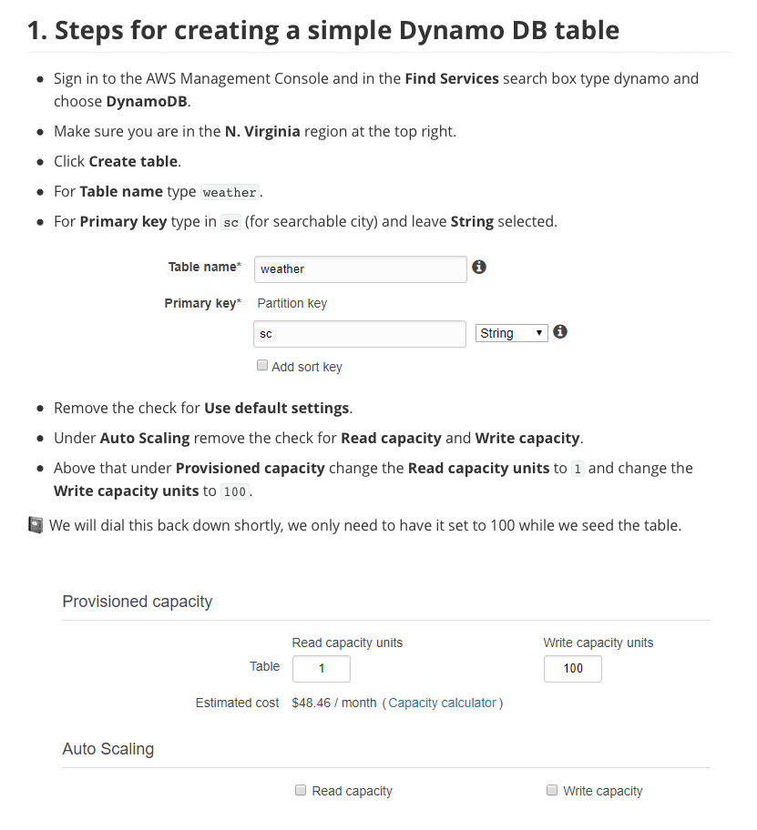

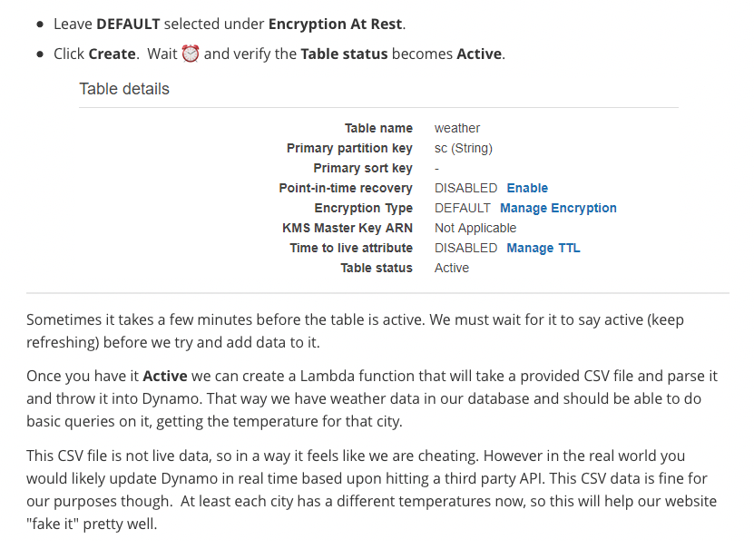

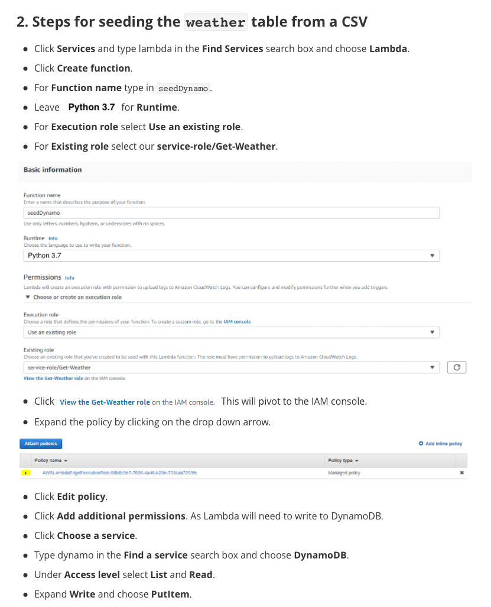

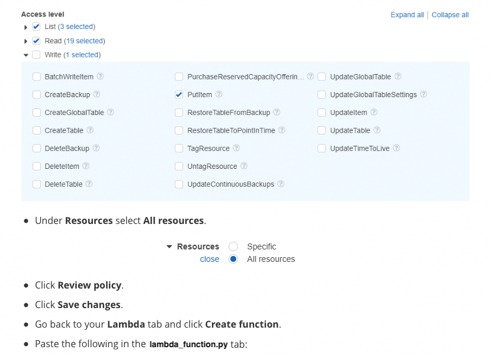

```python
import json
import boto3

def lambda_handler(event, context):
    item = {}
    some_temp_int = 0
    params = {}
    dynamodb = boto3.resource('dynamodb')
    ddb = dynamodb.Table('weather')
    with open('cities.csv', 'r') as f:
        next(f) # skip header
        for line in f:
            city, temperature = line.rstrip().split(',')
            save_to_dynamodb(ddb, city, temperature)
    return {
        'statusCode': 200,
        'body': json.dumps('Hello from Lambda!')
    }
    
def save_to_dynamodb(ddb, city, temperature):
    return ddb.put_item(
                Item={
                  'sc': city,
                  't': temperature
                })
```

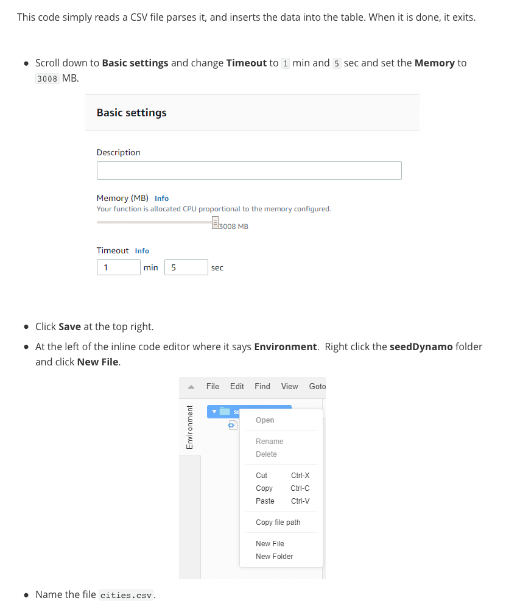

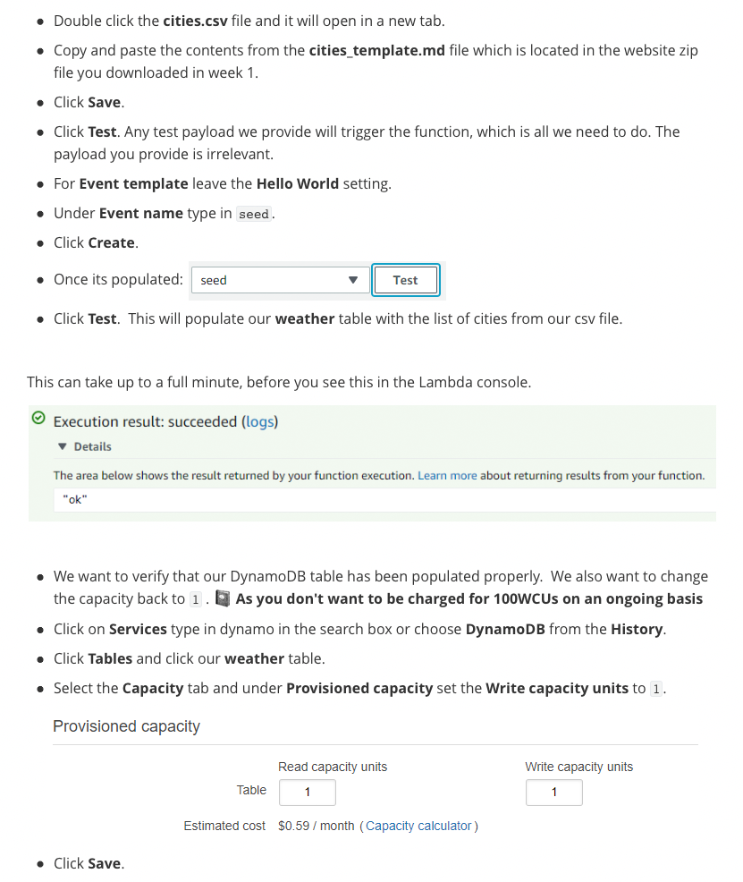

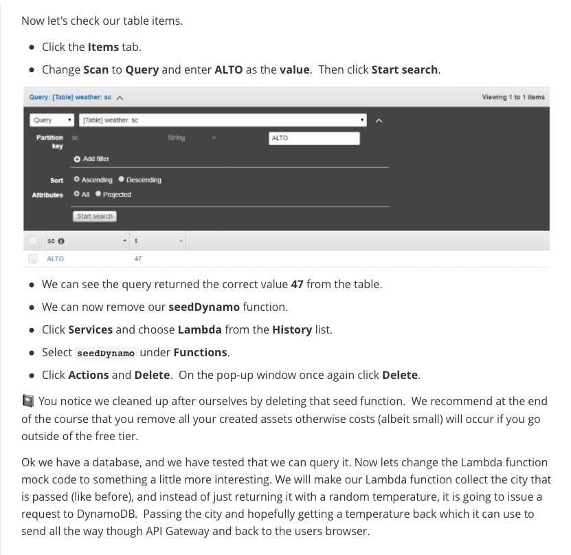

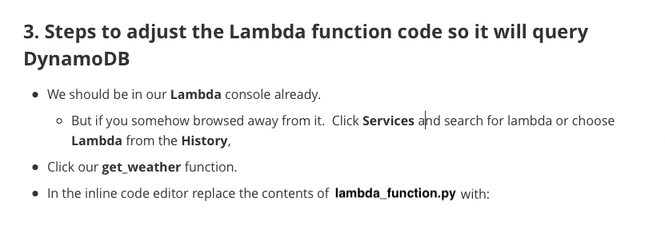

```python
import json
import boto3
from boto3.dynamodb.conditions import Key


def lambda_handler(event, context):
    city_str = event['city_str'].upper()
    response = {}
    try:
        dynamodb = boto3.resource('dynamodb')
        table = dynamodb.Table('weather')
        res = table.query(KeyConditionExpression=Key("sc").eq(city_str))
        json_data = json.loads(json.dumps(res['Items']))[0]
        print(json_data)
        if json_data and json_data["t"]:
            response = {
                "city_str": event['city_str'],
                "temp_int": int(json_data["t"])
            }
        else:
            response = {
                "city_str": event['city_str']
            }
    except Exception as e:
        response = {
        	"statusCode": 500,
        	"headers": {},
        	"body": e
        }
    print(response)
    return response
```

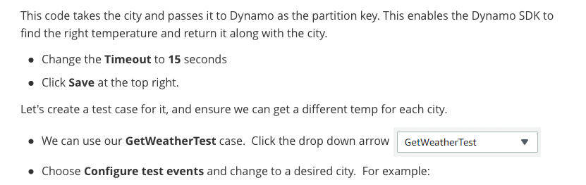

```json
    {
      "city_str": "DENVER"
    }
```


```json
    {
      "temp_int": 38,
      "city_str": "DENVER"
    }
```


```json
    {
      "city_str": "PITTSBURGH"
    }
```


```json
    {
      "temp_int": 78,
      "city_str": "PITTSBURGH"
    }
```

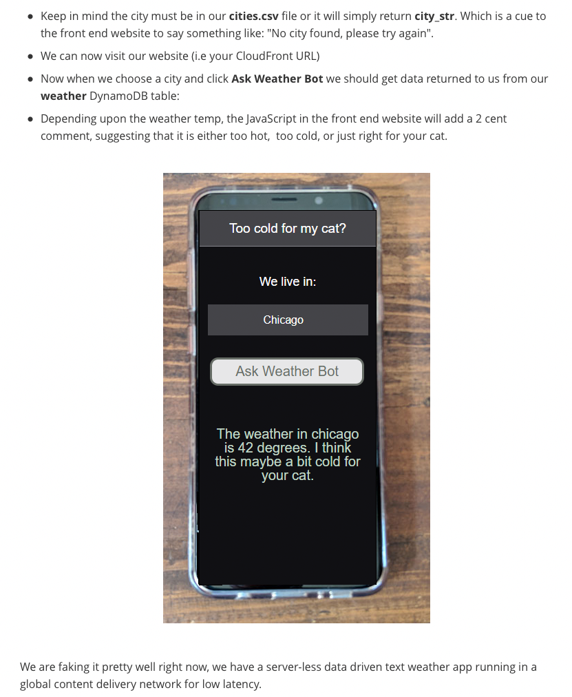


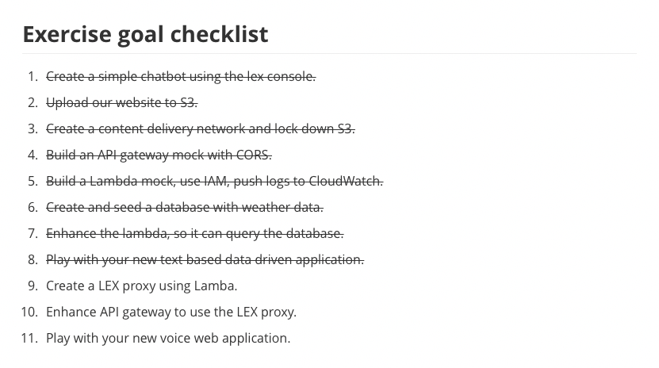