## Exercise 4.1: Make Amazon Lex Smarter

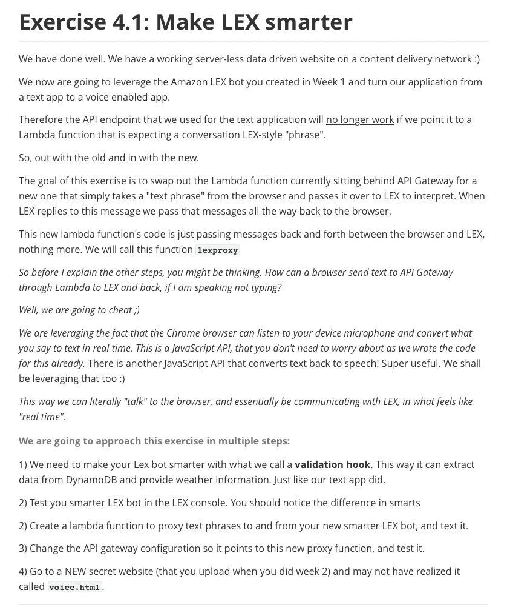

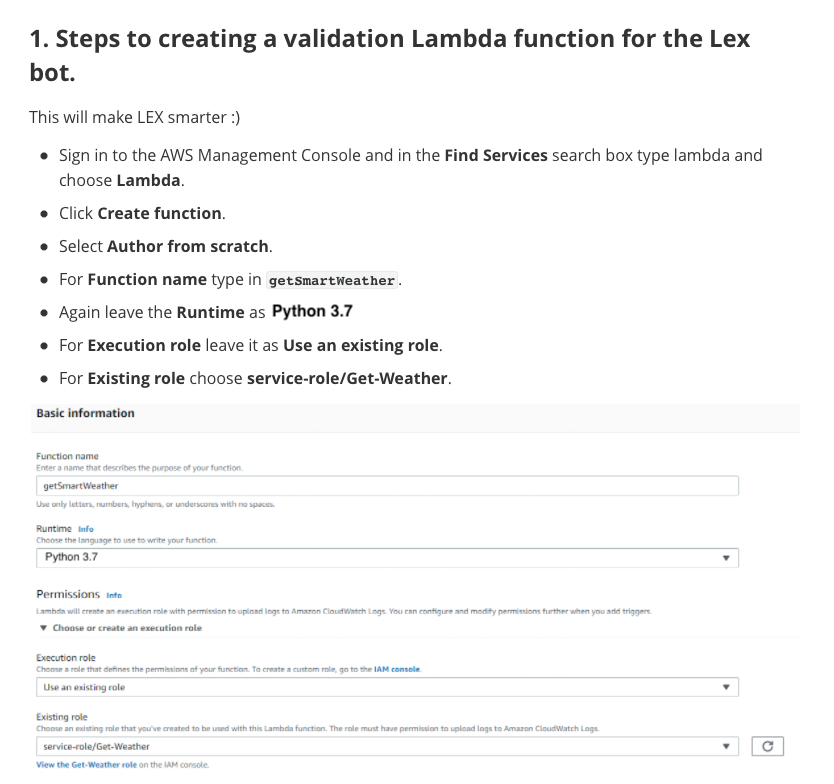


```python
import json
import boto3
from boto3.dynamodb.conditions import Key

def lambda_handler(event, context):
    my_response = {}
    city_str = event['currentIntent']['slots']['city_str']
    if city_str is None:
        my_response['statusCode'] = 200
        my_response['body'] = {
            "dialogAction": {
                "type": "ElicitSlot",
                "message": {
                    "contentType": "PlainText",
                    "content": "Name the city your cat lives in, thanks"
                },
                "intentName": "CatWeather",
                "slots": {
                    "city_str": None
                },
                "slotToElicit" : "city_str"
            }
        }
        
        print(my_response)
        return my_response['body']

    lookup_name_str = city_str.upper() 
    dynamodb = boto3.resource('dynamodb')
    table = dynamodb.Table('weather')
    data = table.query(KeyConditionExpression=Key("sc").eq(lookup_name_str))
    if data['Items'] and data['Items'][0] and data['Items'][0]['t']:
        print("city weather found")
        json_data = json.loads(json.dumps(data['Items']))[0]
        print(json_data)
        my_response['statusCode'] = 200
        my_response['body'] = {
            "sessionAttributes": {
                "temp_str": json_data['t'],
                "city_str": city_str
            },
            "dialogAction":{
                "type": "Close",
                "fulfillmentState": "Fulfilled",
                "message": {
                    "contentType": "PlainText",
                    "content": json_data['t']
                }
            }
        }
    else:
        print("city weather not found for " + lookup_name_str)
        my_response['statusCode'] = 200
        my_response['body'] = {
            "dialogAction": {
                "type": "ElicitSlot",
                "message": {
                    "contentType": "PlainText",
                    "content": "Please try another city, we couldn't find the weather for that city"
                },
                "intentName": "CatWeather",
                "slots": {
                    "city_str": ""
                },
                "slotToElicit" : "city_str"
            }
        }
    return my_response['body']
```

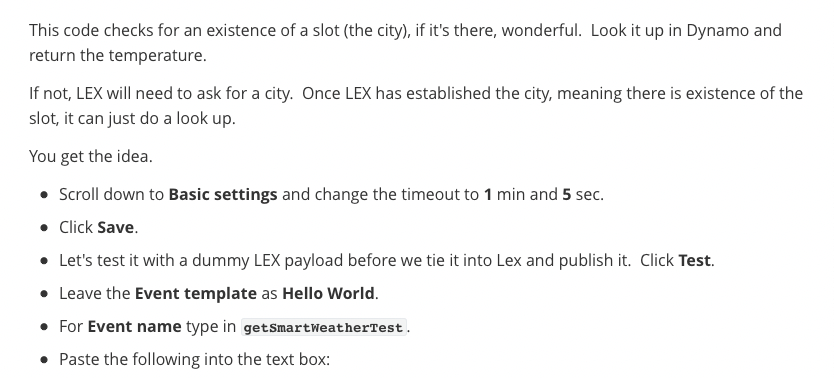

```json
    {
      "messageVersion": "1.0",
      "invocationSource": "DialogCodeHook",
      "userId": "1012602",
      "sessionAttributes": {
      },
      "bot": {
        "name": "WeatherCatBot",
        "alias": "$LATEST",
        "version": "$LATEST"
      },
      "outputDialogMode": "Text",
      "currentIntent": {
        "name": "CatWeather",
        "slots": {
          "city_str": "CHICAGO"
        },
        "confirmationStatus": "None"
      }
    }
```


```json
    {
      "sessionAttributes": {
        "temp_str": "42",
        "city_str": "CHICAGO"
      },
      "dialogAction": {
        "type": "Close",
        "fulfillmentState": "Fulfilled",
        "message": {
          "contentType": "PlainText",
          "content": "42"
        }
      }
    }
```

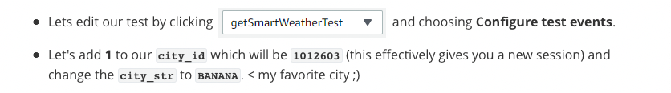

```json
    {
      "messageVersion": "1.0",
      "invocationSource": "DialogCodeHook",
      "userId": "1012603",
      "sessionAttributes": {
      },
      "bot": {
        "name": "weather",
        "alias": "$LATEST",
        "version": "$LATEST"
      },
      "outputDialogMode": "Text",
      "currentIntent": {
        "name": "catWeather",
        "slots": {
          "city_str": "BANANA"
        },
        "confirmationStatus": "None"
      }
    }
```


```json
    {
      "dialogAction": {
        "type": "ElicitSlot",
        "message": {
          "contentType": "PlainText",
          "content": "Please try another city, we couldn't find the weather for that city"
        },
        "intentName": "CatWeather",
        "slots": {
          "city_name_str": null
        },
        "slotToElicit": "city_str"
      }
    }
```

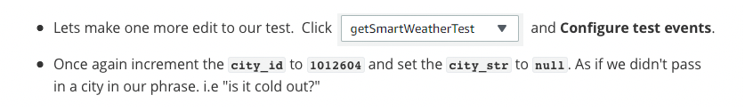

```json
    {
      "messageVersion": "1.0",
      "invocationSource": "DialogCodeHook",
      "userId": "1012604",
      "sessionAttributes": {
      },
      "bot": {
        "name": "weather",
        "alias": "$LATEST",
        "version": "$LATEST"
      },
      "outputDialogMode": "Text",
      "currentIntent": {
        "name": "catWeather",
        "slots": {
          "city_str":  null
        },
        "confirmationStatus": "None"
      }
    }
```


```json
    {
      "dialogAction": {
        "type": "ElicitSlot",
        "message": {
          "contentType": "PlainText",
          "content": "Name the city your cat lives in, thanks"
        },
        "intentName": "CatWeather",
        "slots": {
          "city_str": null
        },
        "slotToElicit": "city_str"
      }
    }
```

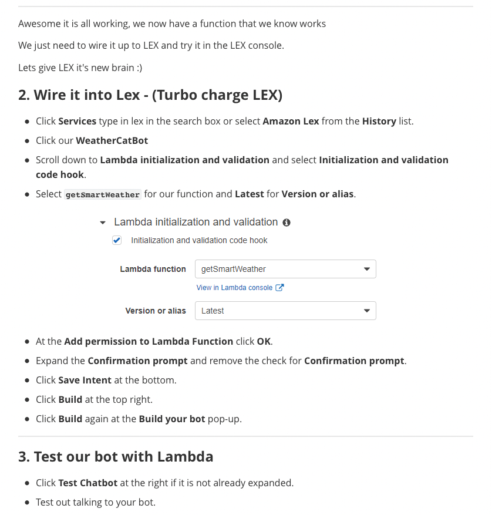

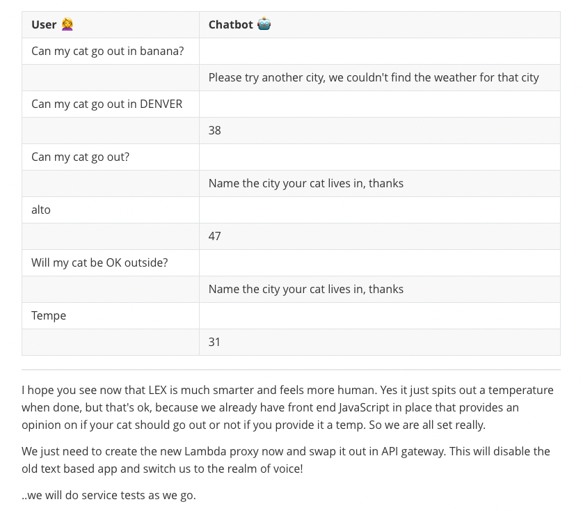

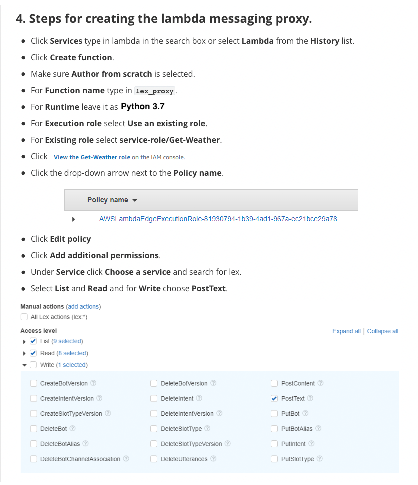

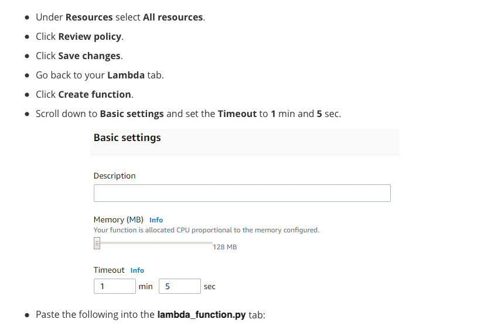

```python
import json
import boto3

def lambda_handler(event, context):
    MESSAGE_STR = event['message_str']
    USER_ID_STR = event['user_id_str']
    BOT_NAME_STR = "WeatherCatBot"
    BOT_ALIAS_STR = "prod"
    client = boto3.client('lex-runtime')
    try:
        return client.post_text(
            botName=BOT_NAME_STR,
            botAlias=BOT_ALIAS_STR,
            userId=USER_ID_STR,
            inputText=MESSAGE_STR
        )
    except Exception as e:
        print(e)
        return "problem with lex"
```

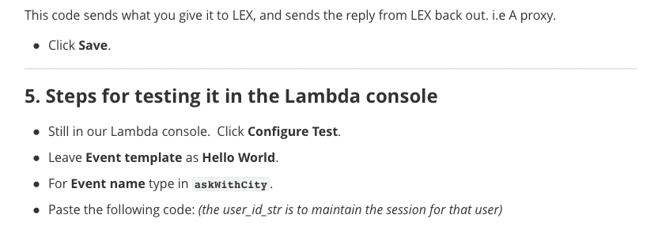

```json
    {
      "message_str": "can my cat go out in alto?",
      "user_id_str": "10126023"
    }
```


```json
    Response:
    {
      "intentName": "CatWeather",
      "slots": {
        "city_str": "alto"
      },
      "sessionAttributes": {
        "city_str": "alto",
        "temp_str": "47"
      },
      "message": "47",
      "messageFormat": "PlainText",
      "dialogState": "Fulfilled",
      "slotToElicit": null
    }
```


```json
    {
      "message_str": "can my cat go out in alto?",
      "user_id_str": "10126023"
    }
```


```json
    {
      "message_str": "can my cat go out?",
      "user_id_str": "10126024"
    }
```


```json
    {
      "intentName": "CatWeather",
      "slots": {
        "city_str": null
      },
      "sessionAttributes": {},
      "message": "Name the city your cat lives in, thanks",
      "messageFormat": "PlainText",
      "dialogState": "ElicitSlot",
      "slotToElicit": "city_str"
    }
```

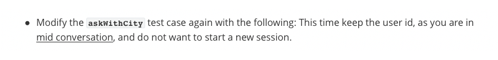

```json
    {
      "message_str": "DENVER",
      "user_id_str": "10126024"
    }
```


```json
   {
      "intentName": "CatWeather",
      "slots": {
        "city_str": "DENVER"
      },
      "sessionAttributes": {
        "city_str": "DENVER",
        "temp_str": "38"
      },
      "message": "38",
      "messageFormat": "PlainText",
      "dialogState": "Fulfilled",
      "slotToElicit": null
    }
```

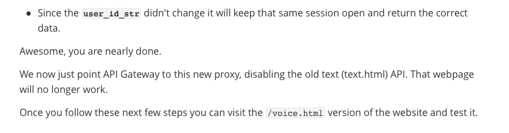

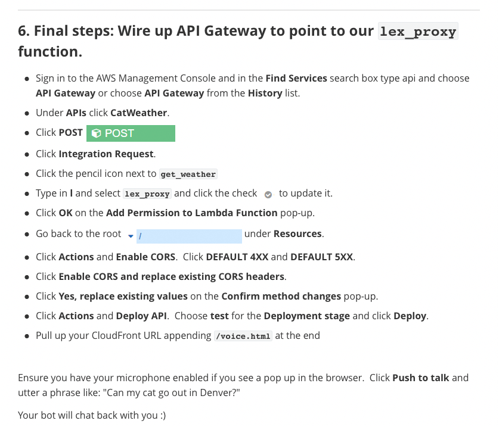

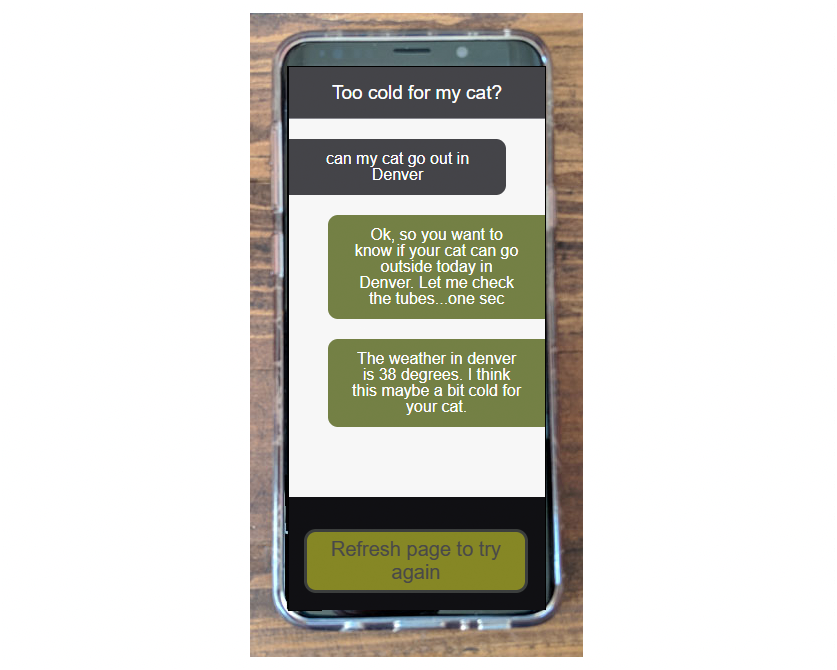

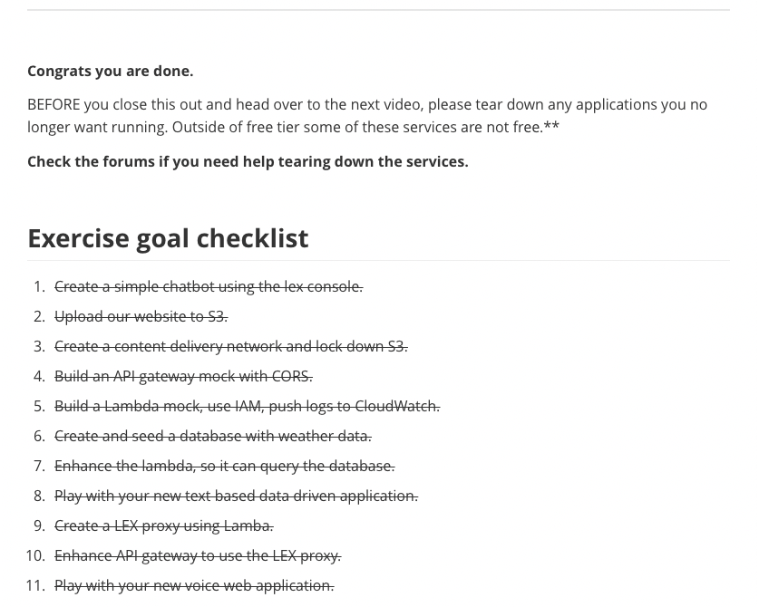

